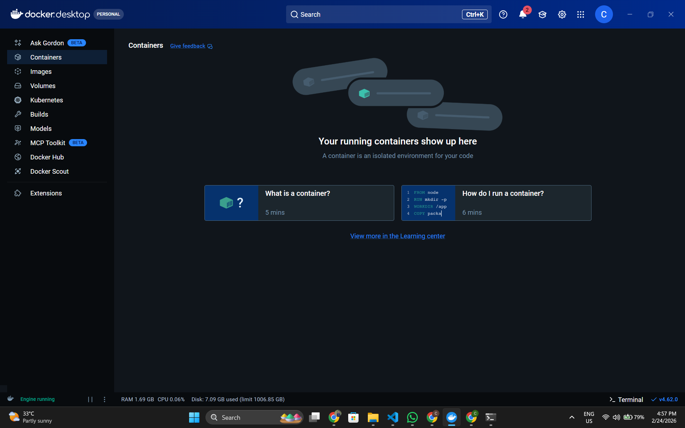
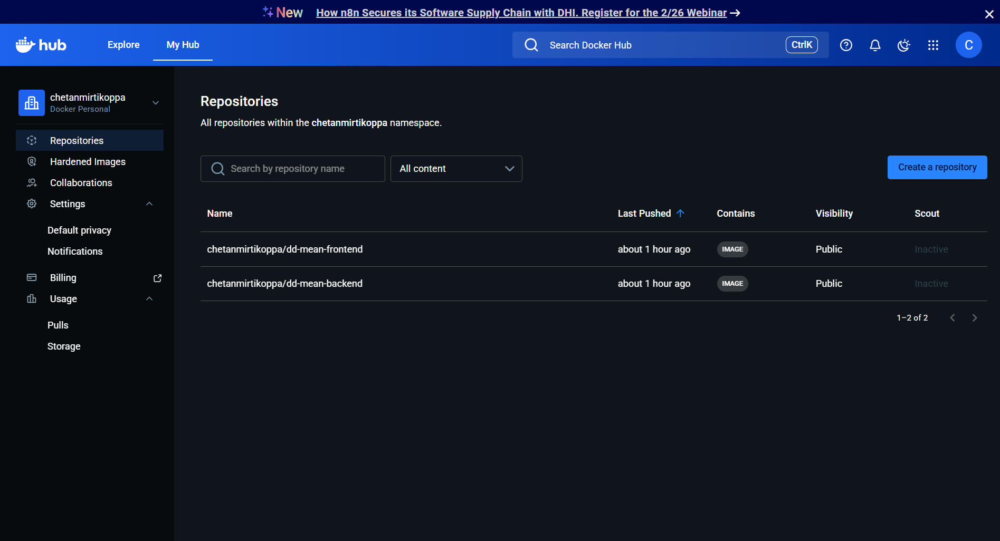
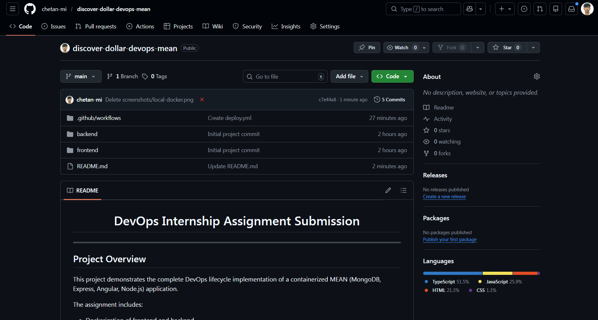
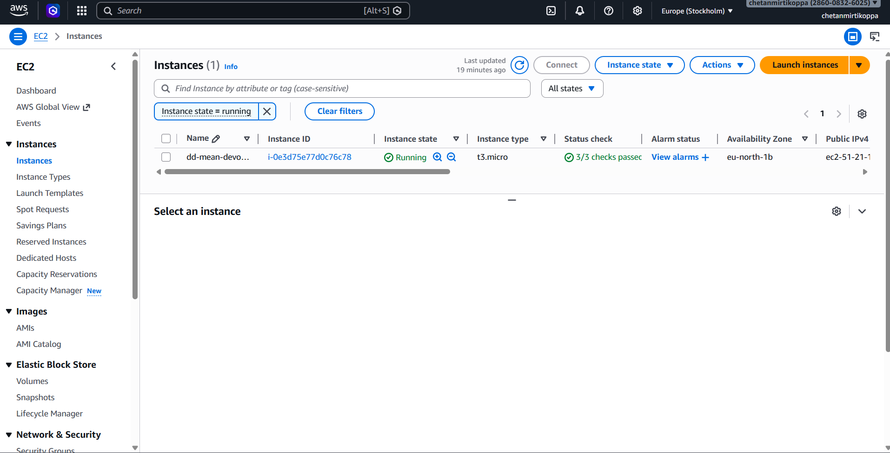
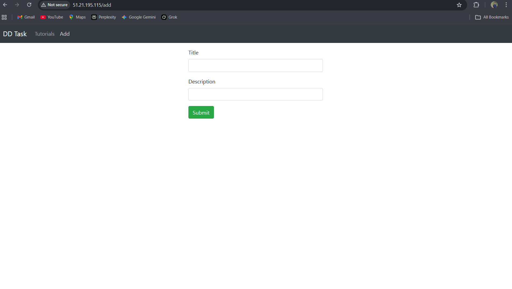

<h1 align="center">DevOps Internship Assignment Submission</h1>

<h2> Project Overview</h2>

This project demonstrates the complete DevOps lifecycle implementation of a 
containerized MEAN (MongoDB, Express, Angular, Node.js) application.

The assignment includes:

<ul>
  <li>Dockerization of frontend and backend</li>
  <li>MongoDB container integration</li>
  <li>Docker Compose orchestration</li>
  <li>Deployment on AWS EC2 (Ubuntu 22.04)</li>
  <li>CI/CD pipeline using GitHub Actions</li>
  <li>Automatic container updates using Watchtower</li>
</ul>

<h2> Architecture Overview</h2>

<pre>
User
  ↓
AWS EC2 (Port 80)
  ↓
Frontend (Angular + Nginx Container)
  ↓
Backend (Node.js + Express Container)
  ↓
MongoDB (Docker Container)
</pre>

Infrastructure Components:

<ul>
  <li>Docker & Docker Compose</li>
  <li>Docker Hub (Image Registry)</li>
  <li>AWS EC2 (Cloud Hosting)</li>
  <li>GitHub Actions (CI/CD)</li>
  <li>Watchtower (Auto Container Update)</li>
</ul>

<h2>🛠 Technology Stack</h2>

<table border="1" cellpadding="8" cellspacing="0">
<tr><th>Layer</th><th>Technology</th></tr>
<tr><td>Frontend</td><td>Angular 15</td></tr>
<tr><td>Backend</td><td>Node.js + Express</td></tr>
<tr><td>Database</td><td>MongoDB</td></tr>
<tr><td>Containerization</td><td>Docker</td></tr>
<tr><td>Orchestration</td><td>Docker Compose</td></tr>
<tr><td>Cloud</td><td>AWS EC2 (Ubuntu 22.04)</td></tr>
<tr><td>CI/CD</td><td>GitHub Actions</td></tr>
<tr><td>Auto Deployment</td><td>Watchtower</td></tr>
</table>

<h2> Local Setup Instructions</h2>

<pre>
git clone YOUR_GITHUB_REPO_LINK
cd crud-dd-task-mean-app
docker compose up --build
</pre>

Access locally at:

<b>http://localhost:4200</b>

<h2> Docker Images</h2>

Docker Hub Repositories:

<ul>
  <li><a href="https://hub.docker.com/r/chetanmirtikoppa/dd-mean-backend">Backend Image</a></li>
  <li><a href="https://hub.docker.com/r/chetanmirtikoppa/dd-mean-frontend">Frontend Image</a></li>
</ul>

<h2>☁ Cloud Deployment</h2>

The application is deployed on AWS EC2 (Ubuntu 22.04).

<b>Live Application URL:</b>

http://51.21.195.115

<h2> CI/CD Pipeline</h2>

GitHub Actions workflow triggers on push to <b>main</b> branch:

<ul>
  <li>Builds Docker images</li>
  <li>Pushes images to Docker Hub</li>
  <li>Watchtower automatically pulls updated images</li>
  <li>Containers restart without manual intervention</li>
</ul>

<h2> Automatic Container Updates</h2>

Watchtower monitors Docker Hub for updated images and automatically:

<ul>
  <li>Pulls new image versions</li>
  <li>Stops old containers</li>
  <li>Restarts containers with latest images</li>
</ul>

<h2>📷 Screenshots</h2>

<h3> 1 Local Docker Containers Running</h3>

<h3>2️ Docker Hub Images</h3>

<h3>3️ GitHub Actions Successful Run</h3>

<h3>4️ EC2 Deployment (docker ps)</h3>

<h3>5️ Live Application on AWS</h3>

<h2> Assignment Completion Summary</h2>

<ul>
  <li>✔ Dockerized full-stack MEAN application</li>
  <li>✔ Implemented Docker Compose orchestration</li>
  <li>✔ Deployed on AWS EC2</li>
  <li>✔ Configured Port 80 access</li>
  <li>✔ Implemented CI/CD pipeline</li>
  <li>✔ Enabled automatic production updates</li>
</ul>

<h2> Conclusion</h2>

This project demonstrates an end-to-end DevOps implementation including 
containerization, cloud deployment, CI/CD automation, and automated 
production updates.

<b>Submitted for DevOps Internship Assessment</b>

